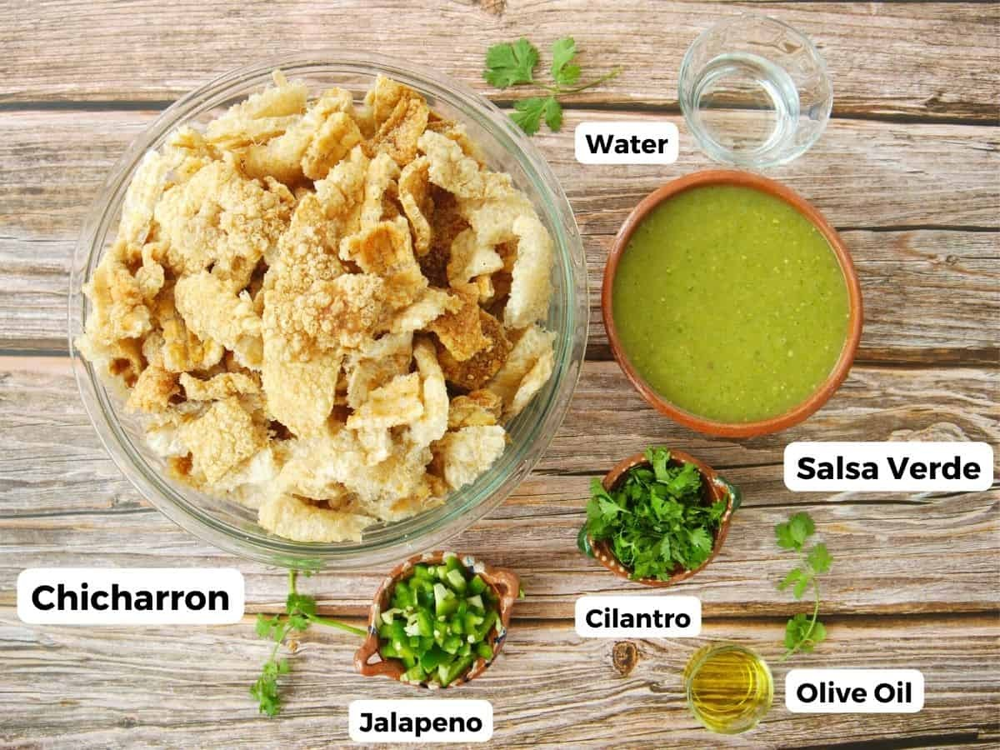

# 
 CHICHARRÓN EN SALSA VERDE 
  

## INGREDIENTES  

| Cantidad       | Ingrediente             |
|----------------|-------------------------|
| 1/2 kg         | de tomate verde         |
|  500 g         | chicharron de cerdo     |
|   1            | cebolla mediana         |
|   4            | chiles serranos/arbol   |
| 1/2 taza       | cilantro                |
| 1 1/2 taza     | de agua                 |
| 4              | dientes de ajo          |        

## PREPARACIÓN

 
 1. Cocer en agua la cebolla picada, los tomates, los chiles y los ajos.  __(hasta que estén transparentes)__.
 2. Los chiles, tomates un diente de ajo y un cuarto de cebolla se deberán colocar dentro de una licuadora para hacer la salsa
 3. Se rebana finamente un cuarto de cebolla
 4. Se guisa agregando los trozos de chicharron y sal al gusto dejando hervir de 3 a 5 minutos.
 5. Se le agrega una pisca de sal, pimienta molida y una pisca de consomé de pollo en polvo
 6. Al apagar se agrega el cilantro picado.

 ### CONSEJO DE LA ABUELA
 

 > **_Si el reflujo quieres evitar, debes de añadir una pizca de bicarbonato de sódio_**
 

## PATROCINADORES

_Patrocinadores para acompañar este tipico platillo Mexicano._ 

