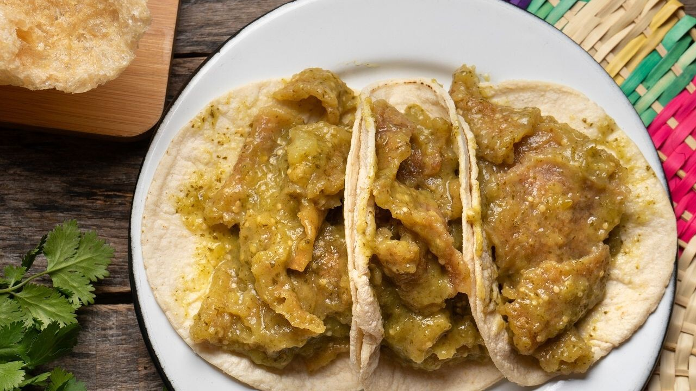
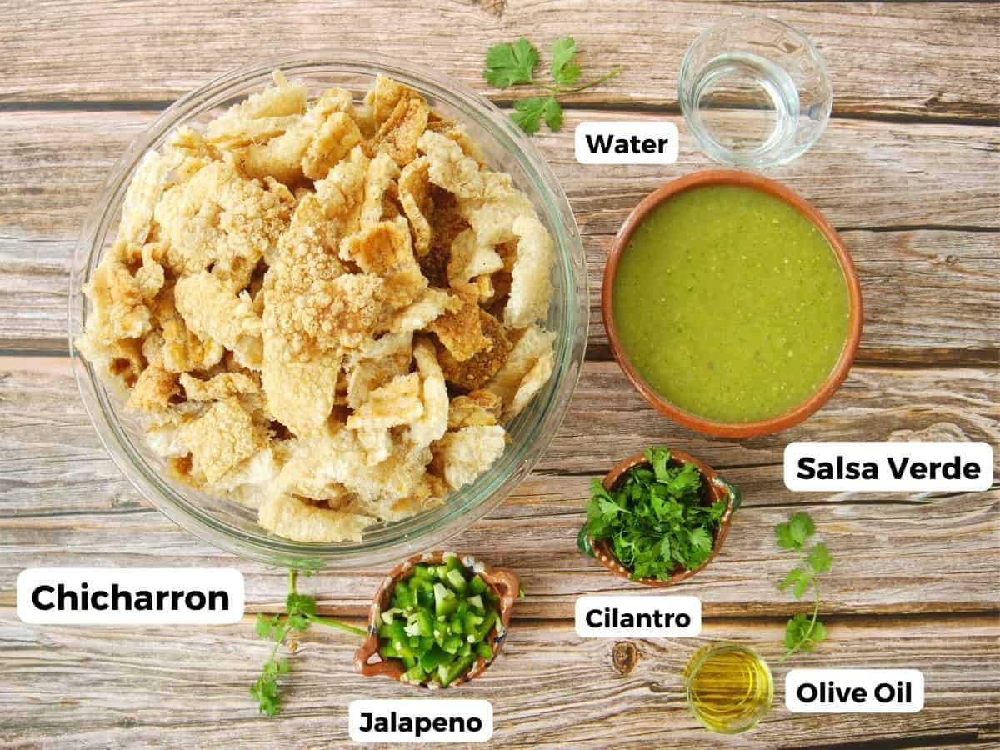

# 
 CHICHARRÓN EN SALSA VERDE 
  

## INGREDIENTES  

| Cantidad       | Ingrediente             |
|----------------|-------------------------|
| 1/2 kg         | de tomate verde         |
|  500 g         | chicharron de cerdo     |
|   1            | cebolla mediana         |
|   4            | chiles serranos/arbol   |
| 1/2 taza       | cilantro                |
| 1 1/2 taza     | de agua                 |
| 4              | dientes de ajo          |        

## PREPARACIÓN

 ## PASO 1. 
 1. Cocer en agua la cebolla picada, los tomates, los chiles y los ajos.  __(hasta que estén transparentes)__.
 ## PASO 2
 2. Se licuan o muelen en molcajete hasta quedar liquida 
 ## PASO 3
 3. Se guisa agregando los trozos de chicharron y sal al gusto dejando hervir de 3 a 5 minutos.
 ## PASO 4
 4. Al apagar se agrega el cilantro picado.
## PATROCINADORES

###_Patrocinadores para acompañar este tipico platillo Mexicano._ 

